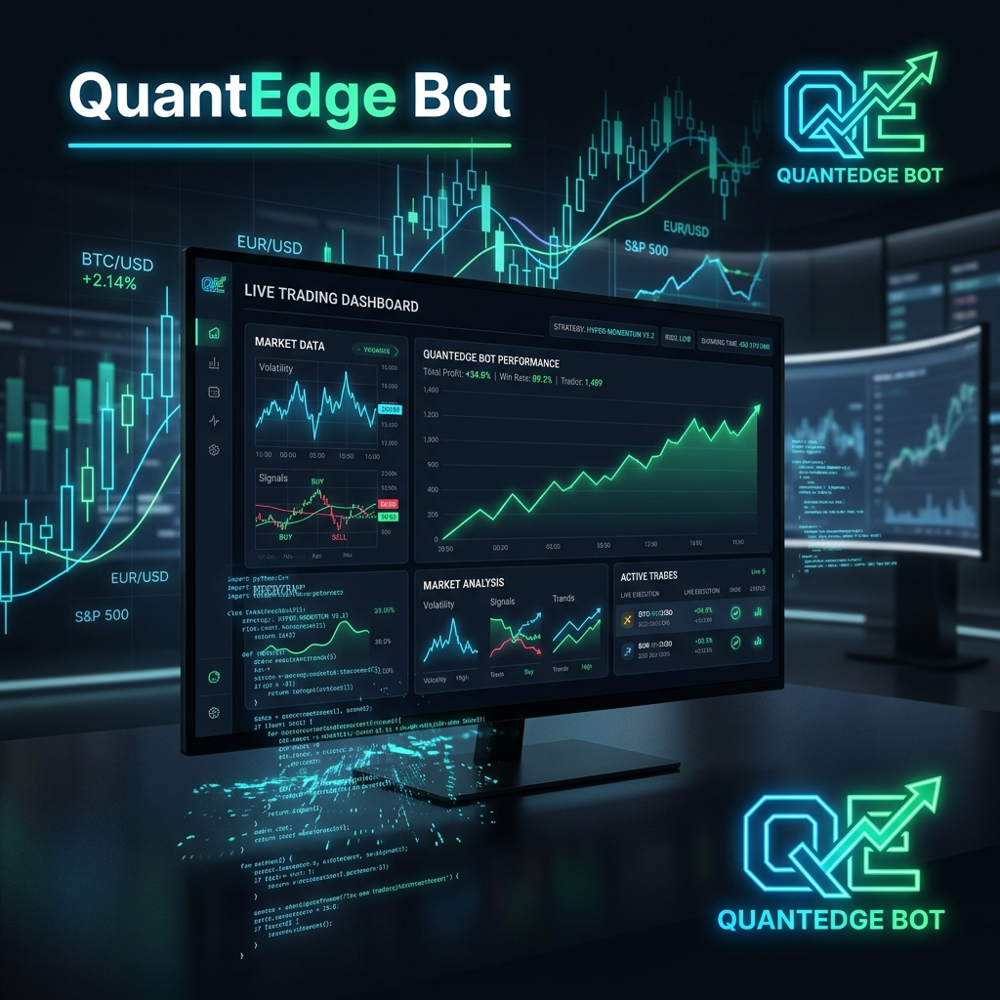

<div align="center">
  
</div>

# QuantEdge Bot


**Production-grade stock market decision-support system for Indian equities.**

Runs automatically every weekday at 9:00 AM IST via GitHub Actions. Sends signals to Telegram. No server required.

> **Not a trade executor.** Generates signals, manages risk, tracks performance. All execution decisions stay with the human.

---

## What it does

```
Market → Regime Detection → Entry Filter → Risk Sizing → Signal → Paper Trade → Telegram Alert
```

Every morning the system:
1. Detects the current market regime (NIFTY 50)
2. Scans 5 NSE stocks for entry/exit signals
3. Scores each signal 0–4 (trend + RSI + volume + pullback depth)
4. Applies ATR-based risk sizing
5. Processes signals through the paper trader
6. Sends a summary to your Telegram bot
7. Commits updated portfolio state back to the repo

---

## Features

| Feature | Details |
|---|---|
| **6-tier regime detection** | STRONG_TREND_UP → STRONG_TREND_DOWN using MA slope + ATR ratio |
| **Regime-aware RSI** | RSI < 35 in strong trends, < 25 in sideways — adapts to market context |
| **4-point signal scoring** | Trend structure + RSI + volume + pullback depth (≥3% from recent high) |
| **ATR-based risk** | Dynamic SL/TP that widens in volatile regimes, narrows in trending ones |
| **Paper trading** | Slippage simulation, gap handling, persistent state across runs |
| **A/B testing** | 5 strategy versions compared on 3 years of data simultaneously |
| **Filter analysis** | Diagnoses which trades the regime filter removed and whether they were profitable |
| **Performance dashboard** | Expectancy by regime/score/symbol, ASCII equity curve, dynamic filter |
| **Telegram alerts** | Daily summary + individual BUY/SELL signals sent to your phone |
| **GitHub Actions** | Fully automated — runs every weekday, no server needed |

---

## Setup

### Local

```bash
git clone https://github.com/SamppurnaTH/quantedge-bot.git
cd quantedge-bot
pip install -r requirements.txt
cp .env.example .env
# Add your TELEGRAM_BOT_TOKEN and TELEGRAM_CHAT_ID to .env
python main.py
```

### Automated (GitHub Actions)

The workflow runs automatically every weekday at 9:00 AM IST.

**One-time setup:**

1. Go to `Settings → Secrets and variables → Actions`
2. Add two secrets:
   - `TELEGRAM_BOT_TOKEN` — from @BotFather on Telegram
   - `TELEGRAM_CHAT_ID` — your chat ID from the Telegram API
3. Go to `Actions → Daily Trading Scan → Run workflow` once to activate the schedule

After that, it runs on its own every weekday morning.

---

## Usage

```bash
# Daily signal scan
python main.py

# Scan + send Telegram alerts
python main.py --telegram

# Automated daily runner
python run_daily.py

# Paper trading
python main.py --paper
python main.py --paper --reset        # fresh start

# Backtesting
python main.py --backtest
python main.py --symbol TCS.NS --backtest

# Analysis
python main.py --regime               # current market regime
python main.py --dashboard            # full performance dashboard
python main.py --ab-test              # compare 5 strategy versions
python main.py --filter-analysis      # which trades did the filter remove?
python main.py --journal              # trade journal analytics
python main.py --compare              # regime filter: with vs without
```

---

## Project structure

```
├── config/settings.py          ← all parameters in one place
├── data/fetcher.py             ← yfinance + CSV cache
├── indicators/
│   ├── rsi.py                  ← Wilder's RSI
│   ├── moving_averages.py      ← SMA / EMA
│   ├── atr.py                  ← Average True Range
│   ├── volume.py               ← volume confirmation
│   ├── regime.py               ← 6-tier regime detection
│   └── engine.py               ← attaches all indicators to DataFrame
├── strategies/
│   └── rsi_ma_strategy.py      ← regime-aware RSI + pullback + scoring
├── risk/manager.py             ← ATR-based SL/TP, position sizing
├── signals/generator.py        ← full pipeline + ranking + dynamic filter
├── backtests/
│   ├── bt_strategy.py          ← Backtrader baseline strategy
│   ├── regime_bt_strategy.py   ← regime-aware Backtrader strategy
│   ├── runner.py               ← single + multi-symbol backtest
│   └── regime_comparison.py    ← 3-way comparison table
├── execution/paper_trader.py   ← paper trading with slippage + gap handling
├── analytics/
│   ├── journal.py              ← trade journal analytics
│   ├── dashboard.py            ← performance dashboard + equity curve
│   ├── ab_test.py              ← A/B testing framework (5 versions)
│   └── filter_analysis.py      ← regime filter diagnostic
├── notifications/telegram.py   ← Telegram alerts
├── logger/
│   ├── setup.py                ← rotating file + console logging
│   ├── trade_tracker.py        ← CSV signal + backtest history
│   └── env_loader.py           ← .env loader
├── state/                      ← persistent paper portfolio (committed by CI)
├── .github/workflows/
│   └── daily_scan.yml          ← GitHub Actions automation
├── run_daily.py                ← daily automation script
├── main.py                     ← CLI entry point
└── requirements.txt
```

---

## Watchlist

`RELIANCE.NS` `TCS.NS` `INFY.NS` `HDFCBANK.NS` `ADANIPOWER.NS`

Edit `DATA_CONFIG["symbols"]` in `config/settings.py` to change it.

---

## Key design decisions

**Why MA200 for regime, not MA50?**

RSI pullback entries happen when price dips below MA50 — that's what creates the oversold reading. Requiring `price > MA50` as a filter directly contradicts the entry signal. MA200 captures long-term trend direction; MA50 slope captures momentum. This was a real bug found and fixed through filter analysis.

**Why does V1_BASELINE sometimes beat the regime filter in backtests?**

TCS's two largest historical wins were counter-trend entries with price below MA200. The regime filter correctly blocks those as high-risk. Whether that's right depends on your risk tolerance. The filter analysis tool (`--filter-analysis`) tells you exactly which trades were removed and whether they were profitable.

**Why paper trade before going live?**

3 years of backtest data doesn't cover every market condition. Paper trading for 8–10 weeks builds a live track record. Only connect live brokerage (Zerodha Kite API) after paper trading shows consistent positive expectancy.

---

## Disclaimer

For research and decision support only. Does not execute trades. Past backtest performance does not guarantee future results.
